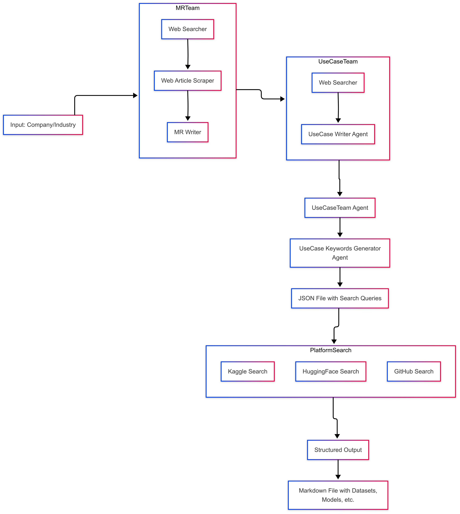

# Methodology

This project employs a multi-agent system to perform market research and generate AI/ML use cases. Below is a detailed description of the methodology:

## High-Level Workflow flowchart

## Multi-Agent Workflow

1. **MRTeam Agent**:
   - A team of three agents working sequentially:
     - **Web Searcher**: Uses DuckDuckGo to search for relevant articles and reports.
     - **Web Article Scraper**: Extracts and structures content from the gathered URLs.
     - **MR Writer**: Synthesizes the extracted content into a comprehensive market research report.

2. **UseCaseTeam Agent**:
   - A team of two agents:
     - **Web Searcher**: Searches for industry-specific AI/ML applications and trends.
     - **UseCase Writer**: Generates a detailed report of AI/ML use cases for the target company or industry.

3. **UseCase Keywords Generator Agent**:
   - Creates platform-specific search queries for Kaggle, HuggingFace, and GitHub based on the use cases.
   - Saves the queries in a JSON file.

4. **Platform Search Agent**:
   - Searches Kaggle, HuggingFace, and GitHub using the generated queries.
   - Structures the results (datasets, models, repositories) into a markdown report.

## Tools and Technologies

- **Agno Library**: Used to create and manage the multi-agent system.
- **DuckDuckGo**: Utilized for web searches to gather relevant information.
- **Gemini API**:
  - **Gemini 1.5 Flash**: Used for tasks requiring fast and efficient processing.
  - **Gemini 2.0 Flash**: Used for tasks requiring advanced capabilities.
- **Streamlit**: Provides an interactive web interface for running the workflow and viewing reports.

## Key Features

- **Sequential Processing**: Each agent processes the output of the previous agent, ensuring a structured and logical workflow.
- **Platform-Specific Queries**: Generates tailored search queries for Kaggle, HuggingFace, and GitHub to discover relevant resources.
- **Comprehensive Reports**: Produces detailed markdown reports and JSON files for easy analysis and sharing.

This methodology ensures a robust and efficient system for market research and use case generation.
